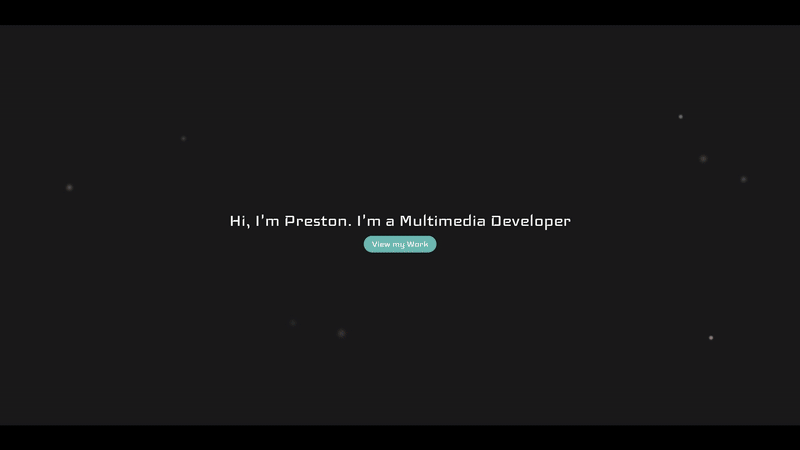

# Welcome to my Portfolio React App!

Active Link: https://prestonschnell.github.io/Portfolio-App/

## Demo

  
## Tech Stack Overview
This portfolio app was built using React.js to create a clean, responsive design. It features a custom click animation, an engaging word randomizer effect on load, and smooth scrolling with anchor-based jump navigation between sections. The site includes form submission functionality, image scrollers, and is fully responsive across all screen sizes. The project was bootstrapped with Create React App and deployed via GitHub Pages.
